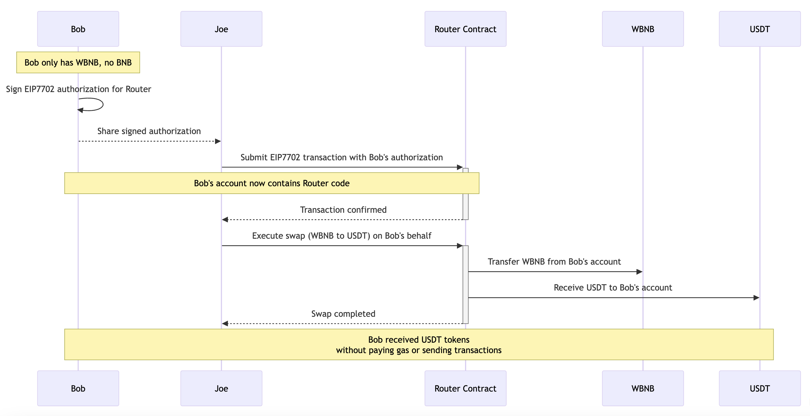

# EIP7702 Demo

This project demonstrates the implementation of EIP7702 (Account Abstraction via Authorized Operations) on BNB Smart Chain (BSC). It includes examples of token swaps and delegated transactions using smart contract wallets.



## Prerequisites

- Go 1.23.0 or later
- Git
- Access to BSC network (Testnet or Mainnet)

## Installation

1. First, ensure your Go environment is properly set up:
```bash
# Check your Go version
go version

# Set GOPATH if not already set
export GOPATH=$HOME/go
export PATH=$PATH:$GOPATH/bin
```

2. Clone the repository:
```bash
mkdir -p $GOPATH/src/github.com/bnb-chain
cd $GOPATH/src/github.com/bnb-chain
git clone https://github.com/bnb-chain/eip7702-demo.git
cd eip7702-demo
```

3. Initialize the Go module and install dependencies:
```bash
# Initialize the module
go mod init github.com/bnb-chain/go/eip7702-demo

# Install dependencies
go mod tidy
```

## Project Structure

```
.
├── bsc/            # BSC-specific implementations
│   └── account.go  # Account management and transactions
├── contracts/      # Smart contract interfaces
│   ├── bep20/     # BEP20 token interface
│   ├── wbnb/      # WBNB specific interface
│   └── V2router/  # Router contract interface
├── main.go        # Main application entry
```

## Features

- Account creation and management
- EIP7702 authorization signing
- Token swaps using router contracts
- BEP20 token interactions
- Transaction building and sending
- Gas estimation and management

## Usage

1. Set up your environment:
Set your private keys in .env file. 
BOB_PRIVATE_KEY & JOE_PRIVATE_KEY (the sponsor)

2. Run the demo:
```bash
go run main.go
```

The demo will:
- Connect to BSC testnet
- Create test accounts
- Sign EIP7702 authorizations
- Execute token swaps
- Check balances

## Example output

```
go run main.go
2025/03/20 07:53:19 Bob's address: 0x8F115EB5019D5Af6075d3F18EC7d36a545bc1429
2025/03/20 07:53:19 Joe's address: 0x66FC363c806fbE28A2bAE4eA33Ee49e5CE9E6915
2025/03/20 07:53:20 Bob's testnet BNB balance: 0
2025/03/20 07:53:28 EIP7702 transaction hash: 0x73406449da2fccddb604ea95f8c93fc727debedb64cefcde35e45c1221f69995
2025/03/20 07:53:30 Bob code hash: ef010066c488c48ff2cb17450391d24b923a92e5f6da5c
2025/03/20 07:53:30 Bob's initial WBNB balance: 10000000000000000
2025/03/20 07:53:30 Bob's initial USDT balance: 21354817536384629186352
2025/03/20 07:53:31 Swap transaction hash: 0xaedff09a0ba762011aeac7834bc674942398d0701e1ffed523ec6b29c80d44aa
2025/03/20 07:53:36 Bob's final USDT balance: 24265780043029900736527
2025/03/20 07:53:36 Bob's final WBNB balance: 0
```

## Example Operations

### Creating an Account
```go
client, _ := ethclient.Dial("https://bsc-testnet.bnbchain.org")
account, err := bsc.NewAccount(client, privateKeyHex)
```

### Signing EIP7702 Authorization
```go
auth := account.SignEIP702Auth(contractAddress, chainId, nonce)
```

### Executing a Token Swap
```go
swapTx, err := routerInstance.SwapExactTokensForTokens(
    opts,
    amountIn,
    amountOutMin,
    path,
    recipient,
    deadline,
)
```

## Security Considerations

- Never share or commit private keys
- Use environment variables for sensitive data
- Test thoroughly on testnet before mainnet
- Verify all transaction parameters
- Monitor gas prices and limits

## Development

### Adding New Features
1. Create a new branch
2. Implement your changes
3. Add tests
4. Submit a pull request

### Testing
```bash
go test ./...
```

## Contributing

1. Fork the repository
2. Create your feature branch
3. Commit your changes
4. Push to the branch
5. Create a new Pull Request

## License

This project is licensed under the MIT License - see the LICENSE file for details.

## References

- [EIP7702 Specification](https://eips.ethereum.org/EIPS/eip-7702)
- [BNB Smart Chain Documentation](https://docs.bnbchain.org/docs/getting-started)
- [Go Ethereum](https://geth.ethereum.org/docs/getting-started)
