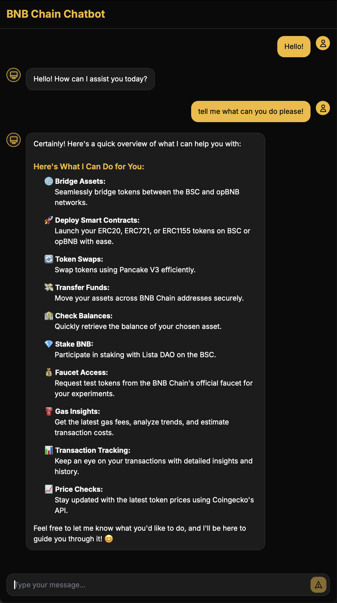

# BNB Chain Chatbot with UI

This project demonstrates how to create a web interface for the BNB Chain Example Hub's Python chatbot, showcasing how to integrate AI agents into decentralized applications (dApps) through API wrappers.

## Overview

This project combines:

- The powerful Python-based chatbot from [BNB Chain Example Hub](https://github.com/bnb-chain/example-hub)
- A modern web interface
- FastAPI for API wrapping and static file serving

The chatbot can assist with various BNB Chain operations provided by the agent kit, including:

- Bridging tokens between BSC and opBNB
- Contract deployment
- Faucet requests
- Balance inquiries
- Staking operations
- Token swaps
- Token transfers
- Gas fee analysis
- Transaction details and history
- Market information



## Prerequisites

- Python 3.12+
- Uv for package management and tooling
  - [Uv installation instructions](https://docs.astral.sh/uv/getting-started/installation/)
- [OpenAI API Key](https://platform.openai.com/docs/quickstart#create-and-export-an-api-key)


## Setup

1. Clone the repository:

```bash
git clone <your-repo-url>
cd chatbot-with-ui
```

2. Create and activate a virtual environment using uv:

   **For macOS/Linux:**

   ```bash
   uv venv
   source .venv/bin/activate  # For bash/zsh
   ```

   **For Windows:**

   ```batch
   uv venv
   .venv\Scripts\activate.bat
   ```

3. Install dependencies:

```bash
uv sync
```

4. Set up environment variables:
   Create a `.env` file in the root directory and copy over the contents of `.env.example`:

   ```env
   # Required
   PRIVATE_KEY=your_private_key_here
   OPENAI_API_KEY=your_openai_api_key_here

   # Optional
   BSCSCAN_API_KEY=your_bscscan_api_key_here
   ```

   You can get these values from:

   - Private Key: Your BNB Chain wallet's private key
   - OpenAI API Key: [OpenAI Platform](https://platform.openai.com/api-keys)
   - BSCScan API Key: [BSCScan API Portal](https://bscscan.com/apidashboard)

   Purpose:

   - Private Key: To utilise BNB Agent Kit 
   - OpenAI API Key: To utilise openAI API for chatbot
   - BSCScan API Key: To access BSCScan data

## Running the Application

1. Activate the virtual environment (if not already activated):

   **For macOS/Linux:**

   ```bash
   source .venv/bin/activate
   ```

   **For Windows:**

   ```batch
   .venv\Scripts\activate.bat
   ```

2. Start the FastAPI server:

   ```bash
   uv run uvicorn api-wrapper:app --reload
   ```

3. Open your browser and navigate to (default port:8000):
   ```
   http://localhost:8000
   ```

The application will serve both the API endpoints and the web interface from the same server.

## Project Structure

```
newchatbot/
├── api-wrapper.py    # FastAPI backend and API wrapper
├── chatbot.py        # Core chatbot logic (from BNB Chain Example Hub)
├── frontend/
│   ├── index.html    # Main HTML file
│   └── app.js        # React application
├── pyproject.toml    # Project configuration
├── .env              # Environment keys and variables
└── README.md         # This file

```

## API Usage

The chatbot exposes a single endpoint:

```http
POST /api/chat
Content-Type: application/json

{
    "message": "Your message here"
}
```

Response:

```json
{
  "reply": "Chatbot's response"
}
```

## Integration with dApps

To integrate this chatbot into your dApp:

1. **API Integration**:

   - Use the `/api/chat` endpoint in your application
   - Handle the responses in your frontend code

2. **Custom Frontend**:

   - The current implementation uses React, but you can use any frontend framework
   - The API is framework-agnostic

3. **Extending Functionality**:
   - Add new endpoints in `api-wrapper.py`
   - Modify the chatbot logic in `chatbot.py`
   - Customize the UI in the `frontend` directory

## Features

### Modern User Interface

- Clean, responsive design with BNB Chain branding
- Real-time chat interface with message history
- Mobile-friendly layout

### Rich Text Support

- Markdown rendering for bot responses
- Support for:
  - Headers (h1, h2, h3)
  - Lists (ordered and unordered)
  - Code blocks with syntax highlighting
  - Inline code
  - Blockquotes
  - Links
  - Tables

## Troubleshooting

### Common Issues

1. **Uv Installation Fails**

   - Ensure you have Python 3.12+ installed
   - Try running the installation command with administrator privileges
   - Check the [official uv installation documentation](https://docs.astral.sh/uv/getting-started/installation/) for alternative installation methods

2. **Virtual Environment Issues**

   - If activation fails, try creating a new terminal window
   - On Windows, ensure you're using the correct activation script for your shell

3. **Port Already in Use**
   - If port 8000 is already in use, you can specify a different port:
   ```bash
   uv run uvicorn api-wrapper:app --reload --port 8001
   ```

## Credits

This project is built upon the Python chatbot from the [BNB Chain Example Hub](https://github.com/bnb-chain/example-hub). The original chatbot provides the core functionality for interacting with the BNB Chain ecosystem.

