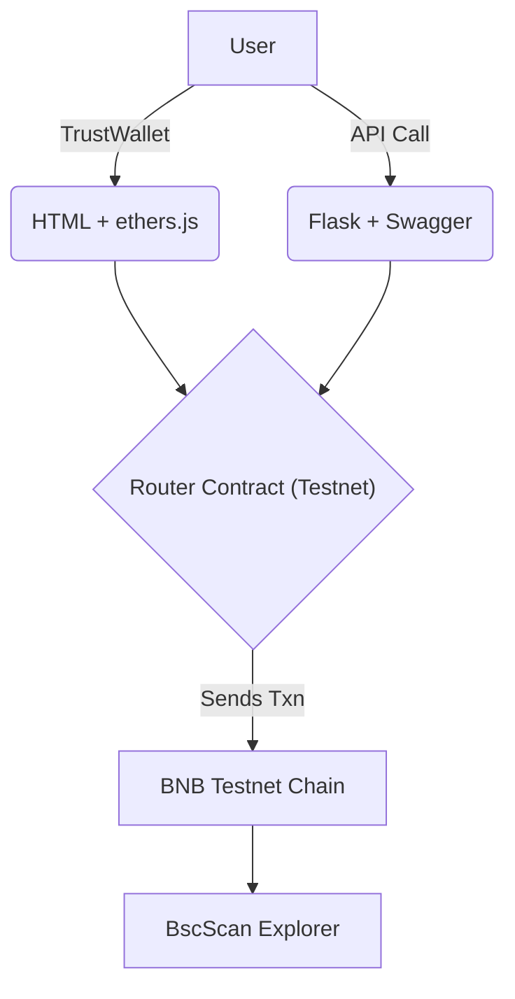

# 🌬️ PancakeSwap Testnet Python + Web3 Swap Example

A complete starter project that lets you swap **tBNB to any token**, and **BEP-20 to BEP-20 tokens** on the **BNB Testnet**, using either a **web UI (TrustWallet)** or a **Python-based API with mnemonic/private key support**.

---

## 📅 Table of Contents

1. [Introduction](#introduction)
2. [Project Structure](#project-structure)
3. [Flow Overview](#flow-overview)
4. [Setup Guide](#setup-guide)
5. [Frontend Swap Usage](#frontend-swap-ui)
6. [Swagger API Usage](#api-swap-usage-via-swagger)
7. [Getting a Testnet Wallet & Address](#getting-testnet-wallet--address)
8. [Getting a Router Contract](#getting-testnet-swap-router-contract)
9. [Getting Testnet tBNB Tokens](#getting-tbnb-tokens)
10. [Web Swap Walkthrough (Trust Wallet)](#web-swap-trust-wallet)
11. [API Walkthrough: tBNB ➔ USDC](#api-walkthrough-swap-tbnb-to-usdc)
12. [API Walkthrough: USDC ➔ tCAKE](#api-walkthrough-swap-usdc-to-tcake)
13. [Note on Wallet Loading](#note-wallet-auth-mnemonic-vs-private-key)

---

## ✨ Introduction
This repo demonstrates:

- Swapping tokens on the **BNB Smart Chain (Testnet)**
- Using `web3.py` and `ethers.js`
- **Trust Wallet** frontend (tBNB ➔ Token)
- **Swagger-based API** (tBNB ➔ Token and Token ➔ Token)
- Secure wallet management via `.env` (mnemonic or private key)

---

## 🌎 Flow Overview (Mermaid Diagram)



---

## 🗂️ Project Structure

```bash
.
├── app.py                 # Flask app + Swagger docs
├── swapper.py             # Core backend swap logic
├── wallet_utils.py        # Load wallet from mnemonic/private key
├── templates/
│   └── index.html         # Simple swap UI with TrustWallet
├── .env.example           # Sample env vars
├── requirements.txt       # Python deps
```

---

## ⚙️ Setup Guide

```bash
# 1. Clone and install
pip install -r requirements.txt

# 2. Copy and fill .env
cp .env.example .env
# Set either MNEMONIC= or PRIVATE_KEY=

# 3. Run the app
python app.py

# 4. Open:
http://localhost:5000       # Web UI
http://localhost:5000/apidocs  # Swagger API
```

---

## 📉 Frontend Swap UI

- Navigate to `http://localhost:5000`
- Connect Trust Wallet / TrustWallet
- Select a token to buy (e.g. tCAKE)
- Enter amount in **tBNB**
- Click **Swap**

All transactions go through:
```
Router: 0x9ac64cc6e4415144c455bd8e4837fea55603e5c3 (Testnet)
```
- The *router* is a smart contract that acts as the main entry point for interacting with PancakeSwap (see it as a Pancake API Gateway).
- The router used here is the *testnet* Pancake Router, if you are deploying to production environment, remember to update it with the mainnet router address.
---

## 📆 API Swap Usage (via Swagger)

Visit `http://localhost:5000/apidocs` to test:

### `/swap` (tBNB ➔ Token)
```json
POST /swap
{
  "token_out": "0x...", // the token address of the token you want to receive
  "amount_bnb": 0.01,
  "slippage": 1,
  "router_address": "0x9ac64cc6e4415144c455bd8e4837fea55603e5c3"
}
```
- Pools are designed to pair WBNB ➔ Token, thus behind the scenes, we have to convert your tBNB to WBNB before swapping to your desired token.

### `/token-swap` (Token ➔ Token)
```json
POST /token-swap
{
  "token_in": "0x...", // the token address of the token you want to swap
  "token_out": "0x...", // the token address of the token you want to receive
  "amount_in": 0.1,
  "slippage": 1,
  "router_address": "0x9ac64cc6e4415144c455bd8e4837fea55603e5c3"
}
```
- Pools are designed to pair WBNB ➔ Token, thus behind the scenes, we have to convert your *token_in* to WBNB before swapping to your desired *token_out*. This is unless you are swapping to WBNB, the function will directly swap to WBNB.

---

## 🚀 Getting Testnet Wallet & Address
1. Visit https://chainlist.org/?testnets=true&search=bsc
2. Add **BNB Smart Chain Testnet** to TrustWallet
3. Create a wallet and copy your address

---

## 🏠 Getting a Testnet Swap Contract (Router)
You can use the PancakeSwap router on testnet:
```
0x9ac64cc6e4415144c455bd8e4837fea55603e5c3
```
- https://developer.pancakeswap.finance/contracts/universal-router/addresses

-  This is PancakeSwap v2 router on BSC Testnet

---

## ⛽️ Getting tBNB Tokens
1. Go to a BNB faucet:
   - https://testnet.bnbchain.org/faucet-smart
   - OR via Discord (https://discord.com/channels/789402563035660308/1121255685146034309)
2. Paste your testnet wallet address
3. Request a small amount of tBNB

---

## 🕹️ Web Swap Walkthrough (Trust Wallet)

1. Open the this app (http://localhost:5000) in your Trust Wallet browser
2. Connect your wallet (TrustWallet compatible)
3. Choose your token (e.g. tCAKE)
4. Enter amount of tBNB to swap
5. Click **Swap**
6. Confirm in wallet & view tx on BscScan

---

## ➡️ API Walkthrough: Swap tBNB ➔ USDC

```json
POST /swap
{
  "token_out": "0x64544969ed7ebf5f083679233325356ebe738930", // USDC
  "amount_bnb": 0.05,
  "slippage": 1,
  "router_address": "0x9ac64cc6e4415144c455bd8e4837fea55603e5c3"
}
```

> ⚠️ The API automatically wraps BNB into WBNB for the swap path.

---

## 🔄 API Walkthrough: Swap USDC ➔ tCAKE

```json
POST /token-swap
{
  "token_in": "0x64544969ed7ebf5f083679233325356ebe738930",   // USDC
  "token_out": "0xFa60D973F7642B748046464e165A65B7323b0DEE", // tCAKE
  "amount_in": 1.0,
  "slippage": 1,
  "router_address": "0x9ac64cc6e4415144c455bd8e4837fea55603e5c3"
}
```

> ✅ Automatically routes through WBNB if direct liquidity is missing.

---

## 🔐 Note: Wallet Auth (Mnemonic vs Private Key)

You can authenticate the backend wallet in 2 ways:

### Option 1: Mnemonic Passphrase
```env
MNEMONIC="twelve word seed phrase here"
```

### Option 2: 256-bit Private Key
```env
PRIVATE_KEY="your_private_key_here"
```

Update `wallet_utils.py` to select one.

---

## ✨ Credits
- Powered by [Web3.py](https://web3py.readthedocs.io)
- Router ABI: PancakeSwap v2
- Frontend: ethers.js + TrustWallet / Trust Wallet
- Backend: Flask + Swagger + Python

---

## ❤️ Contributing
PRs welcome! Want to improve the slippage calc? Add token approval UI? Jump in!

---
